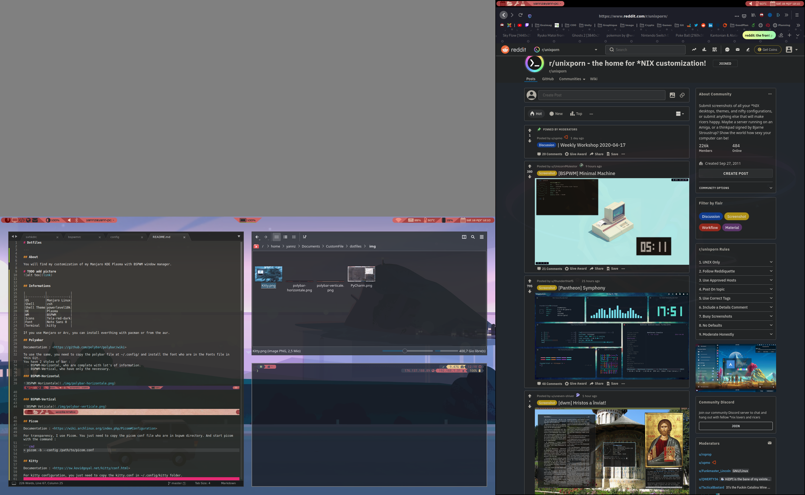
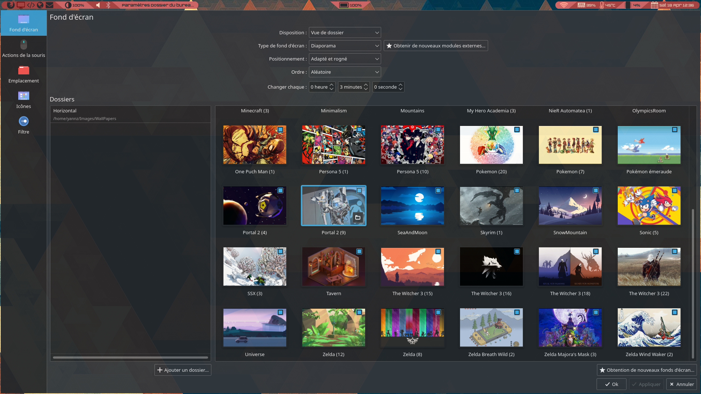
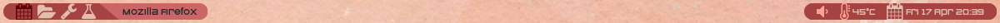
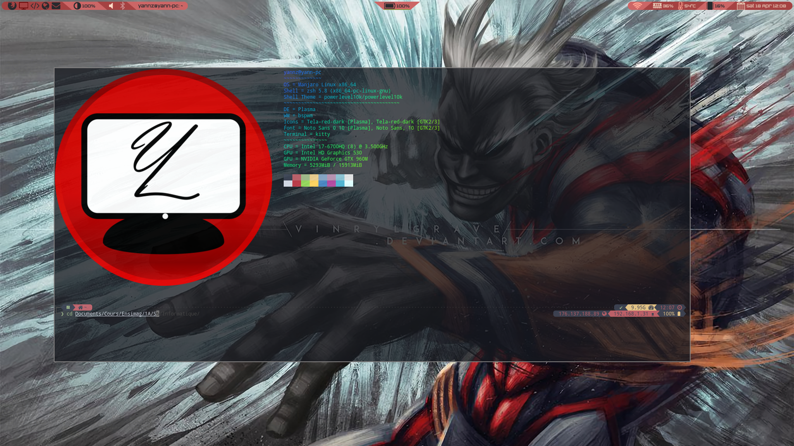
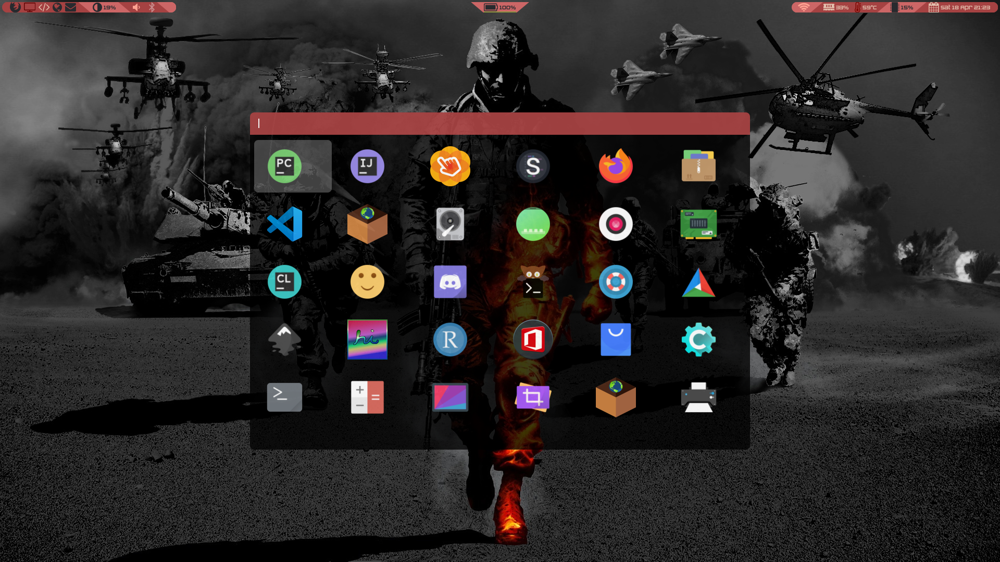
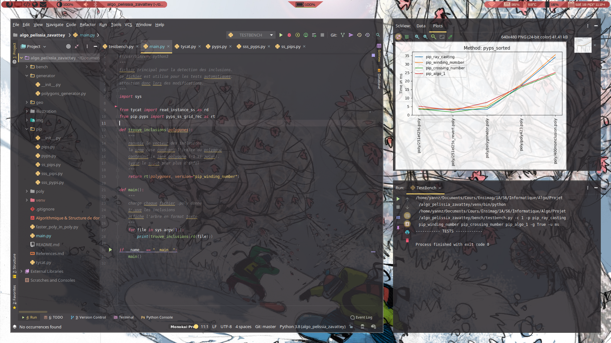

# Dotfiles 

---

## About

You will find my customization of my Manjaro KDE Plasma with BSPWM window manager.

Bellow you have 2 screen shot (the grey part isn't visible it's add by spectacle because my 2 screen haven't the same size).

### Empty Desktop


### Little Busy Desktop


## Informations

|           |             |
|:---------:|:-----------:|
|OS         |Manjaro Linux|
|Shell      |zsh          |
|Shell Theme|powerlevel10k|
|DE         |Plasma       |
|WM         |BSPWM        |
|Icons      |Tela-red-dark|
|Font       |Noto Sans 0  |
|Terminal   |kitty        |

If you use Manjaro or Arc, you can install everthing with pacman or from the aur.

With my configuration, you can't click on the desktop because BSPWM capture mouse position for set focus the nearest window. If you want click on desktop, you need to set property focus_follows_pointer from true to false in the bspwmrc line 36.

```bash
bspc config focus_follows_pointer false
```

## BSPWM & SXHKD

Documentation : <https://github.com/baskerville/bspwm/wiki>, <https://github.com/baskerville/sxhkd>

To setup BSPWM and SXHKD, you can install both from pacman. After that you can remove txt extension of bspwm.desktop.txt and copy it to /usr/share/xsessions. When is done, you can select your desktop when you login on your computer.  


## Wallpaper 

For wallpaper, I use the default wallpaper manager of KDE Plasma. To access it, you need to right click on the desktop and select Desktop configuration. 
**Important** you need to disable focus_follows_pointer on bspwmrc option to click on desktop.



I also share my wallpaper in the Wallpaper folder.

## Polyabar

Documentation : <https://github.com/polybar/polybar/wiki>

To use the same, you need to copy the polybar file at ~/.config/ and install the font who are in the Fonts file in this Git.
You have 2 styles of bar :
  - BSPWM-Horizontal, who are complete with lot's of information.
  - BSPWM-Vertical, who have only the necessary.

### BSPWM-Horizontal


### BSPWM-Vertical



## Picom

Documentation : <https://wiki.archlinux.org/index.php/Picom#Configuration>

For transparency, I use Picom. You just need to copy the picom conf file who are in bspwm directory. And start picom with the command : 

```cmd
> picom -b --config /path/to/picom.conf
```

## Kitty 

Documentation : <https://sw.kovidgoyal.net/kitty/conf.html>

For kitty configuration, you just need to copy the kitty.conf in ~/.config/kitty folder.

For zsh theme, you need to install zsh with pacman and zsh from git here :<br/>
<https://github.com/romkatv/powerlevel10k><br/>
And copy the file oh-my-zsh.sh and the foldeer custom at the place of your installation of zsh.
You also need to instal zsh-completions from pacman.




## Rofi

Documentation : <https://github.com/davatorium/rofi/wiki>

I use Rofi for application launcher. You just need to copy the config.rasi file at ~/.config/rofi



## Idea Suite

For Idea Suite (IntelliJ, Clion, Pycharm...), I use Material UI with Theme Monokai Pro
To install it, go to : File > Settings > Plugin, install Material UI and select Monokai Pro Theme

